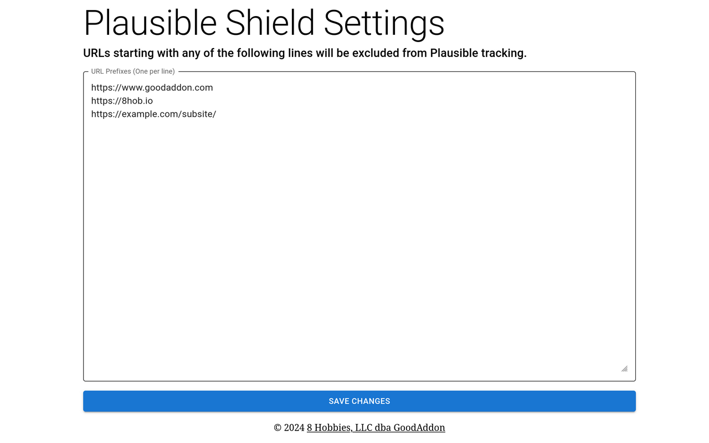

export const description =
  "Automatically shield your browser from Plausible tracking from your websites.";

[Plausible Analytics][] is a privacy-friendly web analytics platform. As website owners, we would
like to shield ourselves from Plausible tracking from our own websites. While [Plausible provides
many ways to shield website owners](https://plausible.io/docs/excluding), it would be convenient if
we can share the list of websites we would like to shield from across all our devices.

This browser extension, Plausible Shield, does exactly this. You set a list of websites that you
would like to shield from, and Plausible Shield:

- automatically blocks Plausible tracking on these websites, and
- enables your browser to sync this list via [sync in
  Chrome](https://support.google.com/chrome/answer/185277?hl=en&co=GENIE.Platform%3DDesktop),
  [Firefox Sync](https://www.mozilla.org/en-US/firefox/features/sync/), or a similar feature from
  another browser.

## Screenshots

## How Do I Know the Extension is Working?

Under the hood, Plausible Shield blocks Plausible tracking using a [localStorage flag officially
supported by Plausible](https://plausible.io/docs/excluding-localstorage). You can visit your
website, fire up the browser console (<kbd>Ctrl+Shift+C</kbd>), and you should see the following
line at the top of the console:

> Ignoring Event: localStorage flag

_Plausible Shield is an open source project. If you are interested, feel free to check out the
[source code](https://github.com/8hobbies/plausible-shield)._

[Plausible Analytics]: https://www.plausible.io
